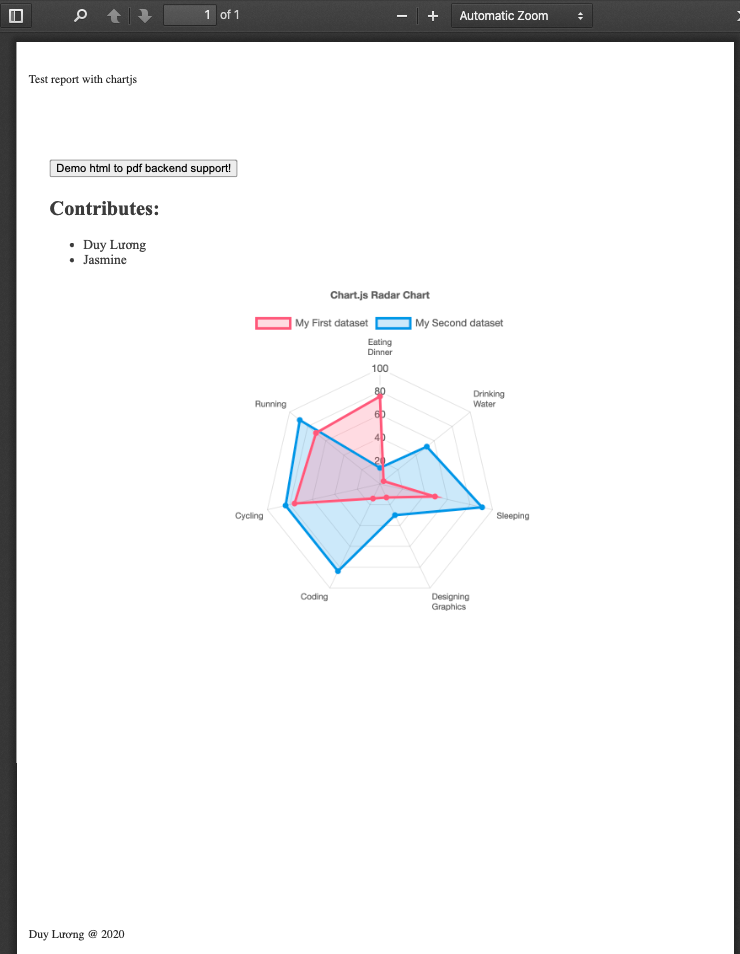

# nodejs-pdf-report

Nodejs export pdf report from base html templates!

[![NPM version][npm-image]][npm-url] [![npm download][download-image]][download-url]

[npm-image]: http://img.shields.io/npm/v/nodejs-pdf-report.svg?style=flat-square
[npm-url]: http://npmjs.org/package/nodejs-pdf-report
[download-image]: https://img.shields.io/npm/dm/nodejs-pdf-report.svg?style=flat-square
[download-url]: https://npmjs.org/package/nodejs-pdf-report

## Install

[](https://npmjs.org/package/nodejs-pdf-report)

```
npm install --save krc-utils
```

## Supports

- Base html template with [EJS](https://github.com/mde/ejs) engine.
- Embeded [Chart.js v2.9.3](https://www.chartjs.org).
- Server side without browser.

## Examples

- Import from package

```
   import { HtmlReport, ReportOptions } from "nodejs-pdf-report";
```

- Define configures

```
const reportOptions: ReportOptions = {
  title: "Test report with chartjs",
  useChartJs: true,
  pdfOptions: {
    margin: {
      top: "100px",
      bottom: "200px",
      right: "30px",
      left: "30px",
    },
  },
  template: "template.ejs",
  headerTemplate: "header-template.ejs",
  footerTemplate: "footer-template.ejs",
  styles: [
      "styles.css"
  ],
  scripts: [
    "utils.js",
    "index.js",
  ],
  data: {
    users: [
        {
            name: "Luong Phung",
        },
        {
            name: "Jasmine",
        },
    ],
    title: "Test report with chartjs",
    author: "Luong Phung",
    time: "2020",
  },
};
```

- Create pdf file as buffer

```
  const htmlReport = new HtmlReport();
  const reportPdf = await htmlReport.createPdf(reportOptions);
  const savePath = path.resolve("./chartjs_report.pdf");
  fs.writeFileSync(savePath, reportPdf, "binary");
```

- Check you report file _"chartjs_report.pdf"_

## Screen shots



## API references

### PdfOptions

| Name            | type                       | default      | Description                                 |
| --------------- | -------------------------- | ------------ | ------------------------------------------- |
| scale           | number                     | 1            | Scale of the webpage rendering              |
| printBackground | boolean                    | false        | Print background graphics.                  |
| landscape       | boolean                    | false        | Paper orientation                           |
| format          | string                     | "A4"         | Page format as : "Letter" "A0" ... "A4" ... |
| margin          | {top, bottom, left, right} | {0, 0, 0, 0} | Page margin as number of pixels             |

### ReportOptions

| Name           | type                       | default | Description            |
| -------------- | -------------------------- | ------- | ---------------------- |
| title          | string                     | null    | Pdf report title       |
| useChartJs     | boolean                    | false   | Use chartjs as default |
| pdfOptions     | [PdfOptions](/#PdfOptions) | null    | any                    |
| template       | string                     | null    | Template path          |
| footerTemplate | string                     | null    | Footer template path   |
| headerTemplate | string                     | null    | Header template path   |
| styles         | string[]                   | []      | Style paths            |
| scripts        | string[]                   | []      | Scripts paths          |
| data           | object                     | {}      | Report data            |

## License

nodejs-pdf-report is released under the MIT license.
